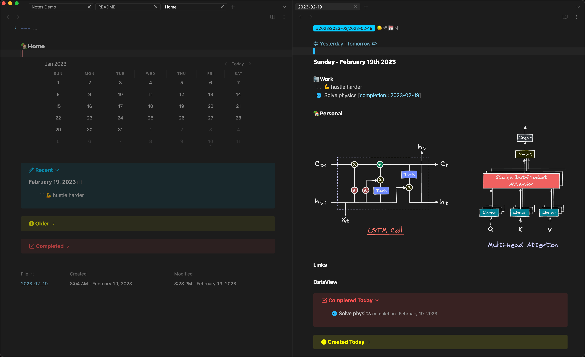

# Notes-Demo

Example Obsidian vault complete with customizations etc

- Daily notes (right) with TODOs automatically tracked on Home screen (left)
	

- Load (local or remote) PDFs in dark mode and annotate side-by-side
	

- Make web-ready slides with [Obsidian Advanced Slides](https://github.com/MSzturc/obsidian-advanced-slides)
	