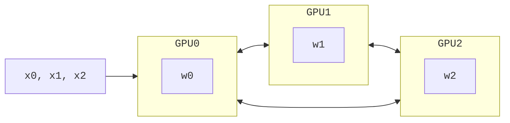
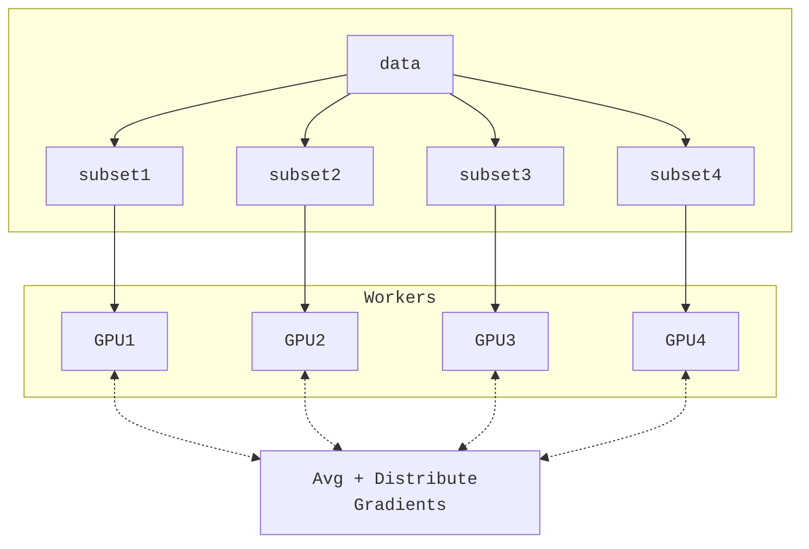
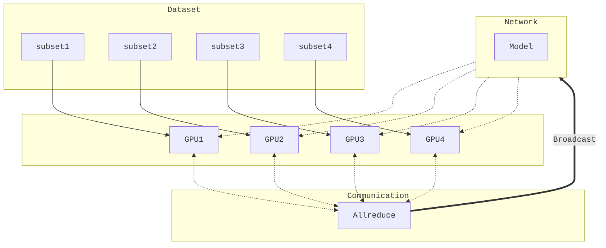
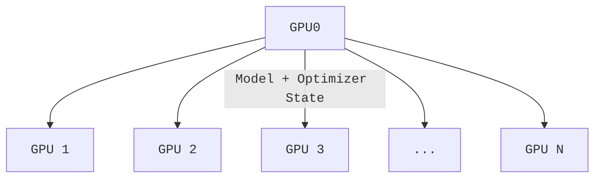

<!-- .slide template="[[template]]" bg="#1c1c1c" -->

# Large Scale Training

---

<!-- .slide template="[[template]]" bg="#1C1C1C" -->

# Why Distributed Training?

- Large batches may not fit in GPU memory
- Splitting data across workers $\longrightarrow$ larger batch size
- Smooth loss landscape
- Improved gradient estimators
- Less iterations needed for same number of epochs
	- May need to train for more epochs if another change is not made
	- e.g. scaling learning rate
- See [Large Batch Training of Convolutional Networks](https://arxiv.org/abs/1708.03888)

---

<!-- .slide bg="#1C1C1C" -->


---

<!-- .slide template="[[template]]" bg="#1c1c1c" -->

# Recent Progress

|              Year               |                  Author                  |            Batch Size            |                  Processor                  |           DL Library            |                Time                |                         Accuracy |
|:-------------------------------:|:----------------------------------------:|:--------------------------------:|:-------------------------------------------:|:-------------------------------:|:----------------------------------:| --------------------------------:|
| <span id="blue">2016</span> |   <span id="blue">He et al. [1]</span>   |    <span id="blue">256</span>    |    <span id="blue">Tesla P100 x8</span>     |  <span id="blue">Caffe</span>   |              <span id="blue">29 Hrs</span>               |                            <span id="blue">75.3%</span> |
|                                 |             Goyal et al. [2]             |               8192               |                 Tesla P100                  |             Caffe 2             |               1 hour               |                            76.3% |
|                                 |             Smith et al. [3]             |         8192 ->  16,384          |                full TPU pod                 |           TensorFlow            |              30 mins               |                            76.1% |
|                                 |             Akiba et al. [4]             |              32,768              |              Tesla P100 x1024               |             Chainer             |              15 mins               |                            74.9% |
|                                 |              Jia et al. [5]              |              65,536              |              Tesla P40  x2048               |           TensorFLow            |              6.6 mins              |                            75.8% |
|                                 |             Ying et al. [6]              |              65,536              |                TPU v3 x1024                 |           TensorFlow            |              1.8 mins              |                            75.2% |
|                                 |            Mikami et al. [7]             |              55,296              |              Tesla V100 x3456               |               NNL               |              2.0 mins              |                           75.29% |
| <span id="red">**2019**</span>  | <span id="red">**Yamazaki et al**</span> | <span id="red">**81,920**</span> | <span id="red">**Tesla V100 x 2048**</span> | <span id="red">**MXNet**</span> | <span id="red">**1.2 mins**</span> | <span id="red">**75.08%**</span> |
<!-- .element style="font-size:0.8em;" -->

---

<!-- .slide template="[[template]]" bg="#1C1C1C" -->
# Model Parallel Training
<!-- .element style="font-size:2.0em;" -->

---

<!-- .slide template="[[template]]" bg="#1C1C1C" -->

<grid drop="0 0" drag="55 100" style="text-align:left;">

# Model Parallel Training

- Split up network over multiple workers
  - Each receives disjoint subset
  - All communication associated with subsets are distributed
- Communication whenever dataflow between two subsets
- Typically **more complicated** to implement than data parallel training
- Suitable when the model is too large to fit onto a single device (CPU / GPU)
</grid>

<grid drop="60 0" drag="40 100">
 <!-- .element align="stretch" -->
</grid>

---

<!-- .slide template="[[template]]" bg="#1C1C1C" -->

<grid drop="0 0" drag="55 100" style="text-align:left;">

# Model Parallel Training

- Suitable when the model is too large to fit onto a single device
  - Partitioning the model into different subsets **is not an easy task**
  - Might introduce load imbalancing issues limiting scale efficiency
- 🤗 [huggingface/transformers](https://github.com/huggingface/transformers) useful reference
  - Excellent series of posts in their documentation on [Model Parallelism](https://huggingface.co/docs/transformers/parallelism)

</grid>

<grid drop="60 0" drag="40 100">
 <!-- .element align="stretch" -->
</grid>

---


<!-- .slide template="[[template]]" bg="#1c1c1c" -->

# Model Parallel Training: Example

$$y = w_0 * x_0 + w_1 * x_1 + w_2 * x_2$$

1. Compute $y_{0} = w_{0} * x_{0}$ and send to $\longrightarrow$ `GPU1`
2. Compute $y_{1} = y_{0} + w_{1} * x_{1}$ and send to $\longrightarrow$ `GPU2`
3. Compute $y = y_{1} * w_{2} * x_{2}$ ✅



<!-- .element align="center" -->

---


<!-- .slide template="[[template]]" bg="#1C1C1C" -->

# Data Parallel Training <!-- .element style="font-size:2.0em;" -->

---

<!-- .slide template="[[template]]" bg="#1C1C1C" -->

<grid drop="0 0" drag="55 100" style="text-align:left!important;">

# Data Parallel Training

- Typically easier to implement
- Existing frameworks ([Horovod](https://horovod.readthedocs.io/en/stable/index.html), [DeepSpeed](https://github.com/microsoft/DeepSpeed), [DDP](https://pytorch.org/docs/stable/notes/ddp.html), etc)
  - Relatively simple to get up and running (minor modifications to code)[^hvd]
- Recent presentation on data-parallel training available on [YouTube](https://youtu.be/930yrXjNkgM)

</grid>

<grid drop="60 0" drag="40 100">

 <!-- .element align="stretch" -->
</grid>

[^1]: [Concepts: Horovod](https://horovod.readthedocs.io/en/stable/concepts_include.html)

---

<!-- .slide template="[[template]]" bg="#1C1C1C" -->

<grid drop="0 0" drag="55 100" style="text-align:left!important;">

# Data Parallel Training

- Each worker has **copy of complete model**
- Global batch of data split into multiple mini-batches
  - Each worker computes the corresponding **loss and gradients from local data**
- Before updating parameters, loss and gradients averaged across workers
</grid>

<grid drop="60 0" drag="40 100">

 <!-- .element align="stretch" -->
</grid>

---

<!-- slide template="[[template]]" bg="#1c1c1c"-->

<grid drag="90 90" drop="top">


</grid>

---

<!-- slide template="[[template]]" bg="#1c1c1c"-->

# Data Parallel Training

- Each worker has identical copy of model
- **Global batch of data split across workers**
- Loss + Grads averaged across workers before updating parameters

  ```mermaid
    %%{init: { "theme": "null", "fontFamily": "monospace", "logLevel": "debug", "deterministicIds": true, "flowchart": { "htmlLabels": true }, "sequence": { "mirrorActors": true } } }%%
  flowchart TD
    D["dataset"] --> S1["subset1"]
    D --> S2["subset2"]
    D --> S3["subset3"]
    D --> S4["subset4"]
    S1 --> W1["Worker 1"]
    S2 --> W2["Worker 2"]
    S3 --> W3["Worker 3"]
    S4 --> W4["Worker 4"]
  ```
  <!-- .element align="center" -->

---

<!-- .slide template="[[template]]" bg="#1c1c1c" -->

<grid drag="40 90" drop="5 10" align="topleft">

# Data Parallel Training

- Each worker receives:
    - **identical copy of model**
    - **unique subset of data**
</grid>


<!-- .element align="right" -->

---

<!-- .slide template="[[template]]" bg="#1c1c1c" -->


<!-- .element align="center" -->

---

<!-- .slide template="[[template]]" bg="#1c1c1c" -->

# Broadcast Initial State

- At the start of training (or when loading from a checkpoint), we want all of our workers to be initialized consistently
	- **Broadcast** the model and optimizer states from `hvd.rank() == 0` worker


<!-- .element align="center" -->

---

<!-- slide template="[[template]]" bg="#1c1c1c"-->

# Best Practices

- Use parallel IO whenever possible
  - Feed each rank from different files
  - Use MPI IO to have each rank read its own batch from a file
  - Use several ranks to read data, MPI to scatter to remaining ranks
    - Most practical in big _at-scale_ training

> [!warning] Computation stalls during communication!
> Keeping the communication to computation ratio small is important for effective scaling

---
<!-- slide template="[[template]]" bg="#1c1c1c"-->

# Best Practices

- Take advantage of data storage
  - Use [striping on lustre](https://wiki.lustre.org/Configuring_Lustre_File_Striping)
  - Use the right optimizations for Aurora, Polaris, etc.
- Preload data when possible
  - Offloading to a GPU frees CPU cycles for loading the next batch of data
    - **minimize IO latency this way**


---
<!-- slide template="[[template]]" bg="#1c1c1c"-->

<grid drag="99 99" drop="top" align="center">

# Comparison


</grid>

---

<!-- .slide template="[[template]]" bg="#1c1c1c" -->

# Horovod: Overview

1. Initialize Horovod[^hvdtf]
2. Assign GPUs to each rank
3. Scale the initial learning rate by num. workers
4. Distribute gradients + broadcast state
    - Distribute gradients by wrapping `tf.GradientTape` with `hvd.DistributedGradientTape`
    - Ensure consistent initialization by broadcasting model weights and optimizer state from `rank == 0` to other workers
5. Ensure workers are always receiving unique data
6. Take global averages when calculating `loss`, `acc`, etc. using `hvd.allreduce(...)`
7. Save checkpoints _only_ from `rank == 0` to prevent race conditions

[^hvdtf]: [Horovod with Tensorflow](https://horovod.readthedocs.io/en/stable/tensorflow.html)

---

<!-- .slide template="[[template]]" bg="#1c1c1c" -->

# TensorFlow + Horovod

- Initialize Horovod:
  ```python
  import horovod.tensorflow as hvd
  hvd.init()
  ```

- Set one GPU per process ID (`hvd.local_rank()`)
  ```python
  gpus = tf.config.experimental.list_physical_devices('GPU')
  for gpu in gpus:
      tf.config.experimental.set_memory_growth(gpu, True)
  if gpus:
      local_rank = hvd.local_rank()
      tf.config.experimental.set_visible_devices(gpus[local_rank], 'GPU')
  ```

---

<!-- .slide template="[[template]]" bg="#1c1c1c" -->

# Scale the Learning Rate

1. Scale by the number of workers to account for increased batch size
  ```python
  import horovod.tensorflow as hvd
  optimizer = tf.optimizers.Adam(lr_init * hvd.size())
  ```

---

<!-- .slide template="[[template]]" bg="#1c1c1c" -->

# TensorFlow + Horovod

- Training step then looks like:

  ```python
  @tf.function
  def train_step(data, model, loss_fn, optimizer, first_batch):
      batch, target = data
      with tf.GradientTape() as tape:
          output = model(batch, training=True)
          loss = loss_fn(target, output)
      tape = hvd.DistributedGradientTape(tape)
      grads = tape.gradient(loss, model.trainable_variables)
      optimizer.apply_gradients(zip(grads, model.trainable_variables))
      if first_batch:
          hvd.broadcast_variables(model.variables, root_rank=0)
          hvd.broadcast_variables(optimizer.variables, root_rank=0)
      return loss, output
  ```

---

<!-- .slide template="[[template]]" bg="#1c1c1c" -->

# Deal with Data

- At each training step, we want to ensure that **each worker receives unique data**
- This can be done in one of two ways:
    1. Manually partition data (ahead of time) and assign different sections to different workers
        1. Each worker can only see their local portion of the data
    2. From each worker, randomly select a mini-batch
        1. Each worker can see the full dataset

> [!Warning] Don't forget your seed!
> When randomly selecting, it is important that each worker uses different seeds to ensure they receive unique data

---

<!-- .slide template="[[template]]" bg="#1c1c1c" -->

# Deal with Data

```python
(images, labels), (xtest, ytest) = (
    tf.keras.datasets.mnist.load_data(path='mnist.npz')
)
dataset = tf.data.Dataset.from_tensor_slices(
    (tf.cast(images[..., None] / 255.0, tf.float32),
     tf.cast(labels, tf.int64))
)
test_dataset = tf.data.Dataset.from_tensor_slices(
    (tf.cast(xtest[..., None] / 255.0, tf.float32),
     tf.cast(ytest, tf.int64)))
)
dataset = dataset.repeat().shuffle(1000).batch(args.batch_size)
test_dataset = (
    test_dataset.shard(
        num_shards=hvd.size(),
        index=hvd.rank()
    ).repeat().batch(args.batch_size)
)
```
<!-- .element style="font-size:0.5em;" -->

---

<!-- .slide template="[[template]]" bg="#1c1c1c" -->

# Average Across Workers

- Typically, we will want to take the global average of the loss across all our workers, for example:
  ```python
  global_loss = hvd.allreduce(loss, average=True)
  global_acc = hvd.allreduce(acc, average=True)
  ```

---

<!-- .slide template="[[template]]" bg="#1c1c1c" -->

# `ai4sci`

```bash
📁 07_largeScaleTraining/src/ai4sci/
├── 📁 conf/
│   └── ⚙️ config.yaml
├── 📃 ilsvrc.json
├── 📃 main.sh             # CLI script for training
├── 🐍 __init__.py
├── 🐍 ilsvrc_dataset.py
├── 🐍 main.py       # main entry point
├── 🐍 network.py    # define network architecture
└── 🐍 trainer.py    # implement Trainer object
```
<!-- .element style="line-height:1.5em!important; font-family:monospace!important;" -->

---

<!-- .slide template="[[template]]" bg="#1c1c1c" -->

# Hands-On

1. Navigate to `ai-science-training-series`
2. `git pull`
3. Navigate into `07_largeScaleTraining/src/ai4sci`
4. To run (with a `batch_size=512`):
  ```bash
  ./main.sh batch_size=512 > main-bs-512.log 2>&1 &
  ```
6. View output:
  ```bash
  tail -f "main-bs-512.log" $(tail -1 logs/latest)
  ```

---

<!-- .slide template="[[template]]" bg="#1c1c1c" -->

# Thank you!

- Organizers
- ALCF Data Science & Operations

- Feel free to reach out!
  <split even >

    [<i class="fas fa-home"></i>](https://samforeman.me)
    [<i class="far fa-paper-plane"></i>](mailto:///foremans@anl.gov)
    [<i class="fab fa-twitter"></i>](https://www.twitter.com/saforem2)
     </split>

> [!INFO] Acknowledgements
> This research used resources of the Argonne Leadership Computing Facility, which is a DOE Office of Science User Facility supported under Contract DE-AC02-06CH11357.
<!-- .element style="max-width:90%;" -->

---


<style>

:root {
    --callout-radius:5px;
    --r-math-color:#FAFAFA;
    --cm-inline-background: #242424;
    --cm-inline-foreground: #00CCFF;
    --r-heading-text-transform: none;
    --primaryBorderColor: #666666;
    --r-heading-font: 'Inter', 'Arial', "OpenSans-Bold", "Open Sans", Helvetica, Impact, sans-serif;
    --r-main-background-color: #1c1c1c!important;
    --r-main-font: 'Inter', "Arial", "Open Sans", "Coming Soon", "SourceSansPro", Helvetica Neue, sans-serif;
    --r-heading-letter-spacing: -0.45px;
    --r-heading-word-spacing: 0.5px;
    --r-heading-text-transform: none;
    --r-heading-text-shadow: none;
    --r-heading-font-weight: 700;
    --r-heading1-text-shadow: none;
    --r-main-font-size: 22px;
    --r-main-line-height: 1.5em;
    --r-monospace-font-size: 18px;
    --r-heading1-size: 1.33em;
    --r-heading2-size: 1.25em;
    --r-heading3-size: 1.2em;
    --r-heading4-size: 1.15em;
    --r-heading5-size: 1.05em;
    --r-heading6-size: 1.025em;
    --r-heading-line-height:1.5em;
    --r-main-font-family: 'Inter';
    --r-code-font: "JuliaMono", "agave Nerd Font", "Hack", "VictorMono", monospace;
    --r-link-color: #03A9F4;
    --r-link-color-dark: #f92672;
    --r-link-color-hover: #63ff51;
    --r-accent-color: #77CA29;
    --r-controls-color: #228BE6;
    --r-progress-color: #404040;
    --r-header-accent: #1E8BC9;
    --r-selection-background-color: RGBA(255, 255, 0, 0.15);
    --r-selection-color: RGB(255, 255, 0);
    --r-main-color: #c8c8c8;
    --text-muted: #757575;
    --text-faint: #404040;
    --r-heading-color: #FFF;
    --r-background-color: #1c1c1c;
    --cm-keyword: #c792ea;
    --cm-atom: #f78c6c;
    --cm-number: #ff5370;
    --cm-type: #decb6b;
    --cm-def: #82aaff;
    --cm-property: #c792ea;
    --cm-variable: #f07178;
    --cm-variable-2: #EEFFFF;
    --cm-variable-3: #f07178;
    --cm-definition: #82aaff;
    --cm-callee: #89ddff;
    --cm-qualifier: #decb6b;
    --cm-operator: #89ddff;
    --cm-hr: #98e342;
    --cm-link: #696d70;
    --cm-header: #da7dae;
    --cm-builtin: #ffcb6b;
    --cm-meta: #ffcb6b;
    --cm-matching-bracket: #FFFFFF;
    --cm-tag: #ff5370;
    --cm-tag-in-comment: #ff5370;
    --cm-string-2: #f07178;
    --cm-bracket: #ff5370;
    --cm-comment: #676e95;
    --cm-string: #c3e88d;
    --cm-attribute: #c792ea;
    --cm-attribute-in-comment: #c792ea;
    --cm-background-color: #1c1c1c;
    --cm-active-line-background-color: #353a50;
    --cm-foreground-color: #AE81FF;
    --code-normal: #AE81FF;
    -webkit-font-smoothing:subpixel-antialiased;
    --font-smoothing:subpixel-antialiased;
    --chart-color-1: #ff00ff;
    --chart-color-x: RGB(255.0,255.0,255.0);
}

.standout{
    background: var(--cm-background-color);
    padding:5px;
    font-weight:700;
    border-radius:6px;
}

.reveal pre {
  display:block;
  margin:auto;
  width:auto;
  font-family: var(--r-code-font);
  font-size: var(--r-monospace-font-size);
  padding: auto;
  white-space: pre-wrap;
}

.reveal p {
  margin:auto!important;
  padding:auto!important;
}

.reveal pre code {
    display: inline-block;
    top: 2px;
    white-space: pre;
    bottom: 2px;
    margin:auto;
    padding:auto;
    font-size: 0.8em;
    background:var(--cm-background-color);
    color: var(--cm-foreground-color)!important;
    text-align: justify;
    letter-spacing: -0.45px!important;
    word-spacing: -0.5px!important;
}

.reveal {
    font-family: var(--r-main-font), sans-serif;
    font-size: var(--r-main-font-size);
    font-weight: normal;
    color: var(--r-main-color);
    background-color: var(--r-main-background-color);
}


.reveal blockquote p {
    color: var(--text-muted);
    font-style: normal !important;
    font-align: left;
    display: inline;
    text-align: left;
}

.reveal blockquote em{
  color: var(--text-muted);
  text-align: left;
}

.reveal blockquote {
  border-radius: 8px !important;
  margin: 0.5rem 0rem 0.5rem 0rem;
  text-align: left;
  padding-top: 1rem;
  padding-left: 2rem;
  padding-bottom: 1rem;
  padding-right: 2rem;
  width: auto;
  font-style: normal !important;
}

.reveal blockquote {
	font-size: unset;
	margin: auto;
	padding:auto;
}


.reveal ul, ol {
	text-align:left;
}

.reveal ul ul,
.reveal ul ol,
.reveal ol ol,
.reveal ol ul {
  text-align:left;
}

.reveal ul ul {
    list-style: circle;
}
.container {
  position: relative;
}

.make-it-pop {
  filter: drop-shadow(0 0 10px purple);
}

@media (max-width: 95%) {
  section {
    -webkit-flex-direction: column;
    flex-direction: column;
  }
}

.footer {
  font-size: 60%;
  vertical-align:bottom;
  color:#bdbdbd;
  font-weight:400;
  margin-left:-5px;
}
.note {
  color:#f8f8f8;
  border-radius:8px;
  background-color:#35353540;
  width: max-content;
  border-color:#66666640;
  padding: auto;
  margin:auto;
}

#blue {
  color: #00CCFF;
}

#red {
  color: #FF5252;
}

.callout {
  overflow: hidden;
  border-style: none;
  border-color: RGBA(var(--callout-color), var(--callout-border-opacity));
  border-width: var(--callout-border-width);
  border-radius: var(--callout-radius);
  margin: 1em 0;
  mix-blend-mode: var(--callout-blend-mode);
  background-color: rgba(var(--callout-color), 0.1);
  padding: var(--callout-padding);
}
.callout-title {
  font-size: var(--callout-title-size);
  color: RGB(var(--callout-color));
  background-color: RGB(var(--callout-color), 0.0);
  line-height: var(--line-height-tight);
  font-weight: 700;
}
.callout-content {
  overflow-x: auto;
  padding: auto;
  background-color: var(--callout-content-background);
}
.callout-icon {
  flex: 0 0 auto;
  padding: auto;
  display: flex;
  align-self: center;
}
.callout-icon .svg-icon {
  color: RGB(var(--callout-color));
}
.callout-title-inner {
  font-weight: var(--bold-weight);
  color: var(--callout-title-color);
}
.callout-fold {
  display: flex;
  align-items: center;
  padding-right: var(--size-4-2);
}

.reveal .code-wrapper code {
	width: 98%;
}
.reveal code {
  font-family: var(--r-code-font);
  text-transform: none;
  tab-size: 4;
  background-color:var(--cm-background-color);
  color: var(--cm-foreground-color);
  border-radius:2px;
  letter-spacing: -0.45px!important;
  word-spacing: -0.5px!important;
}

.reveal pre code {
	padding: auto;
	border:none;
	border-radius:2px;
	font-size:0.9em;
	margin:auto;
	background: var(--cm-background-color);
}
.reveal p code {
  font-family: var(--r-code-font);
  text-transform: none;
  tab-size: 4;
  padding:auto;
  font-size:0.9em!important;
  line-height:inherit;
  background:var(--cm-inline-background);
  color: var(--cm-inline-foreground);
  border-radius:3px;
  letter-spacing: -0.45px!important;
  word-spacing: -0.5px!important;
}

mjx-container[jax="CHTML"][display="true"] mjx-math {
  color: var(--r-math-color);
}

mjx-math {
  color: var(--r-math-color);
  background: none!important;
  padding:unset;
  vertical-align:inherit;
}
#customcontrols > ul {
  display: none!important;
}

#customcontrols button {
  display: none!important;
}

.reveal .slides > section.present, .reveal .slides > section > section.present {
  min-height: 100% !important;
  display: flex !important;
  flex-direction: column !important;
  justify-content: center !important;
  position: absolute !important;
  top: 0 !important;
}
section > h1 {
  position: absolute !important;
  top: 0 !important;
  margin-left: auto !important;
  margin-right: auto !important;
  left: 0 !important;
  right: 0 !important;
}

h1 {
	border-bottom: 3px solid var(--r-header-accent);
	text-align: left!important;
	min-width: max-content;
	max-width: min-content;
}

.print-pdf .reveal .slides > section.present, .print-pdf .reveal .slides > section > section.present {
  min-height: 770px !important;
  position: relative !important;
}

.hljs {
    background: var(--cm-background-color) !important;
	font-size:inherit;
}

.hljs-main {
	color: #ff5252
}

.hljs-built_in {
  color: #63ff5b;
}

.hljs-comment, .hljs-quote, .hljs-deletion {
	color: #454545;
}

.hljs-params{
	color: #03A9F4;
}

.hljs-meta {
	color: #AE81FF;
}

.hljs-string {
	color: #FFFF00;
}

strong {
	color: #FF5252!important;
	font-weight: 700;
}

ul {
	margin-left: 0;
	padding-left:1em;
}

ol {
	margin-left: 0;
	padding-left:1em;
}

.reveal .code-wrapper code {
 st white-space: unset;
}

.reveal pre {
white-space: pre-wrap;
}


.reveal sup {
	font-size:0.6em;
}

.markdown-rendered code {
  color: var(--code-normal)!important;
  font-family: var(--font-monospace);
}

body.fallback-highlighting[class*="theme-"] .markdown-preview-view pre.cm-s-obsidian[class*="language-"], body.fallback-highlighting[class*="theme-"] .markdown-preview-view code[class*="language-"], body.fallback-highlighting[class*="theme-"] .markdown-preview-view .HyperMD-codeblock, body.fallback-highlighting[class*="theme-"] .markdown-preview-view .cm-hmd-codeblock {
  --font-monospace: var(--cm-font-monospace);
  color: var(--cm-foreground-color);
  font-family: var(--cm-font-monospace);
  font-weight: var(--cm-font-weight);
  line-height: var(--cm-line-height);
  font-size: var(--cm-font-size);
  white-space: var(--cm-wrap-lines);
}

.reveal .code-wrapper code {
  color: #B0BEC5;
  font-family: var(--r-code-font);
  font-size: 18px;
  line-height:1.1em;
}

</style>

<script> var config = { theme: 'default', logLevel: 'fatal', securityLevel: 'strict', startOnLoad: true, arrowMarkerAbsolute: false, er: { diagramPadding: 20, layoutDirection: 'TB', minEntityWidth: 100, minEntityHeight: 75, entityPadding: 15, stroke: 'gray', fill: 'honeydew', fontSize: 12, useMaxWidth: true, }, flowchart: { diagramPadding: 8, htmlLabels: true, curve: 'basis', }, sequence: { diagramMarginX: 50, diagramMarginY: 10, actorMargin: 50, width: 150, height: 65, boxMargin: 10, boxTextMargin: 5, noteMargin: 10, messageMargin: 35, messageAlign: 'center', mirrorActors: true, bottomMarginAdj: 1, useMaxWidth: true, rightAngles: false, showSequenceNumbers: false, }, gantt: { titleTopMargin: 25, barHeight: 20, barGap: 4, topPadding: 50, leftPadding: 75, gridLineStartPadding: 35, fontSize: 11, fontFamily: '"Open Sans", sans-serif', numberSectionStyles: 4, axisFormat: '%Y-%m-%d', topAxis: false, }, }; mermaid.initialize(config); </script>